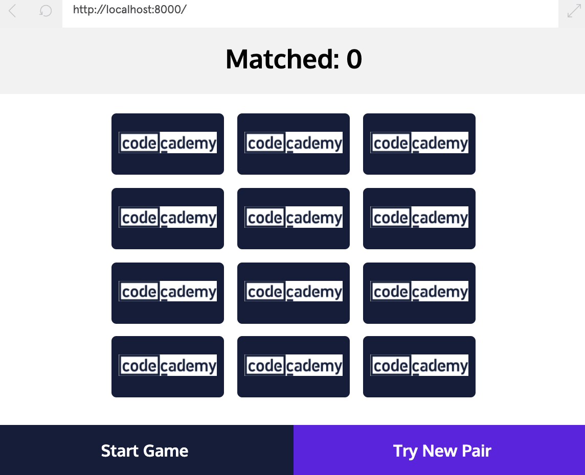
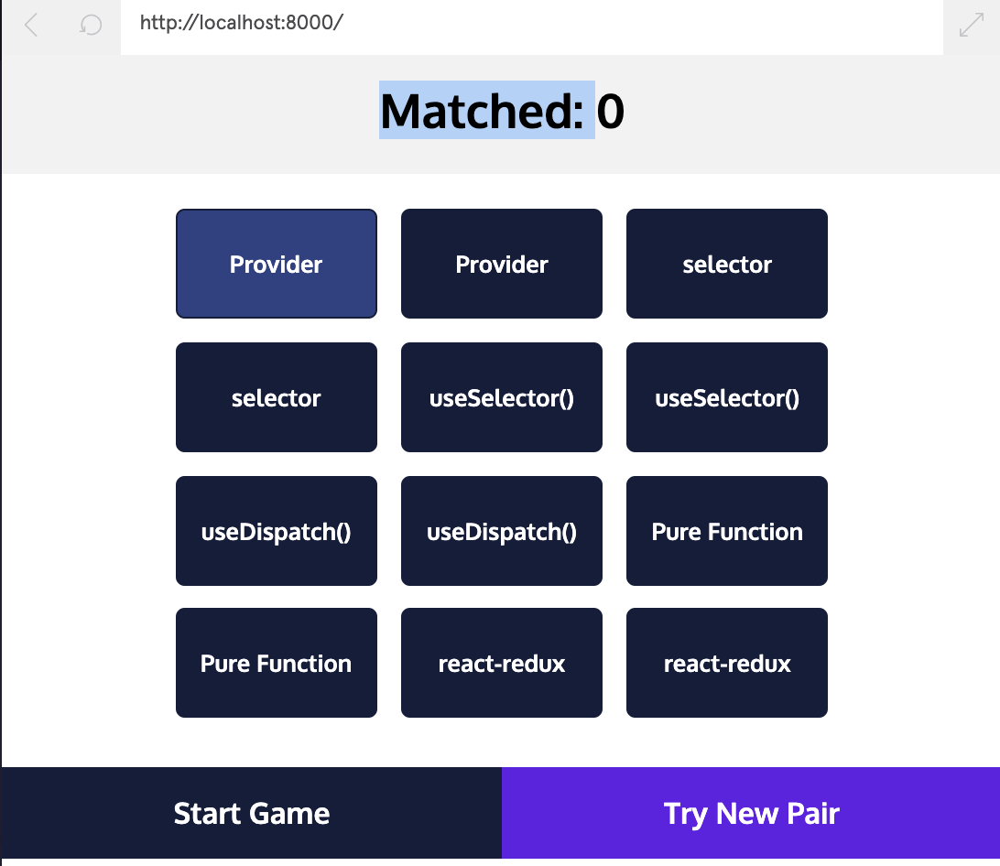

# Matching Memory:

### Provide the Redux Store to Your Application
Note: [Provider React-Redux documentation](https://react-redux.js.org/api/provider)

1a. In index.js, import the Provider component.
```javascript
import { Provider } from 'react-redux';
```
2a. Implement Provider inside the ReactDOM.render() function.
Note: Pay attention to the comma and its placement.
Note: Pay attention to the store property and its assignment. 
```javascript
ReactDOM.render(
  // Implement Provider component with store below
  // https://react-redux.js.org/api/provider
  <Provider store={store}>
    <App />
  </Provider>,
  document.getElementById('root')
);
```

### Create the Board Layout
At the bottom of boardSlice.js:
Note: Take a look at the hint if stuck. It really is helpful.

3a. Create an export statement with a defined selector, selectBoard.
```javascript
export const selectBoard = () => "SOMETHING GOES HERE";
```
3b. The selector should return an array created by state.board.map().
```javascript
export const selectBoard = (state) => state.board.map();
```
3c. The callback function for the map() function should return an object {id: card.id, contents: card.contents}, where card is the argument of the callback function.
```javascript
export const selectorFunction = state => state.selectedData
  .map(object => ({p1: object.p1, p2: object.p2}));
```
The example above shows me that selectorFunction is my selectBoard.
The selectedData is my board.
The argument in my callback is card. Aka object = card in this case. 
p1 is id, p2 is contents.
Note: When returning an object from a single-line arrow function you must wrap the object in parentheses.
```javascript
export const selectBoard = (state) => state.board.map(card => ({id: card.id, contents: card.contents}));
```
4a. In Board.js, start with the necessary import statements.
Import useSelector from react-redux. [React Redux Hooks documentation](https://react-redux.js.org/api/hooks)
```javascript
import { useSelector } from 'react-redux';
```
4b. Import the selector you implemented in the previous step from ./boardSlice.js.
```javascript
import { selectBoard } from './boardSlice.js';
```
5a. Inside the Board component define a variable named currentBoard and assign it the data retrieved from calling useSelector() with the selectBoard selector.
```javascript
const currentBoard = useSelector(selectBoard);
```
6a. To update the row number calculation, reassign the variable numberOfCards to the length of the array of cards, currentBoard.
```javascript
const numberOfCards = currentBoard.length;
```
6b. Inside the utility function getRowCards(), replace the empty object inside rowCards.push() with currentBoard[cardIndex].
```javascript
rowCards.push(currentBoard[cardIndex])
```


### Show Your Cards
In boardSlice.js, implement a selector:

7a. Create an export statement with a defined selector, selectVisibleIDs.
Note: At the bottom of the boardSlice.js file, write the function.
```javascript
export const selectVisibleIDs = () => "Something Here"
```
7b. The selector should return an array that filters the board array and then maps the filtered array. Use state.board.filter().map(). 
```javascript
export const selectVisibleIDs = (state) => state.board.filter().map();
```
7c. The callback function for filter() should test card.visible, where card is the parameter of the callback function.
Note: I google searched filter an array of objects.
[JS Filter for this specific case](https://www.javascripttutorial.net/javascript-array-filter/)
```javascript
export const selectVisibleIDs = (state) => state.board.filter(card => card.visible).map();
// Check if card.visible === true works as well.
export const selectVisibleIDs = (state) => state.board.filter(card => card.visible === true).map();
```
7d. The callback function for map() should return card.id, where card is the parameter of the callback function.
```javascript
export const selectVisibleIDs = (state) => state.board.filter(card => card.visible === true).map(card => card.id);
```
With the selector complete, open Card.js to begin implementing the presentation behavior of the Card component.

In Card.js, start with the necessary imports:

8a. Import useSelector from react-redux.
```javascript
import { useSelector } from 'react-redux';
```
8b. Import the selector you implemented in the previous step from boardSlice.js.
```javascript
import { selectVisibleIDs } from '../../boardSlice';
```
Retrieve the visible card data to know which card to display on the board.

9a. Inside the Card component definition: Define a variable named visibleIDs and assign it the data retrieved from calling useSelector() with the selectVisibleIDs selector.
```javascript
const visibleIDs = useSelector(selectVisibleIDs);
```
10a. Inside the Card component definition: Remove the false in the first if statement. Instead, check that the Card component’s id prop is included in visibleIDs array.
[JS Includes documentation](https://developer.mozilla.org/en-US/docs/Web/JavaScript/Reference/Global_Objects/Array/includes)
```javascript
if (visibleIDs.includes(id)) {
  cardText = contents;
  click = () => {};
}
```
You should now see all the cards in their initialized order.


### Start the Game
Open App.js where you will find the function startGameHandler(). You need to dispatch the action from this function.

11a. In App.js, start with imports: Import useDispatch from react-redux.
```javascript
import { useDispatch } from 'react-redux';
```
11b. Import the setBoard action creator from boardSlice.js.
```javascript
import { setBoard } from './features/board/boardSlice.js';
```
Now you can dispatch the action created by setBoard() within startGameHandler(). The setBoard() action creator takes no arguments.

12a. Inside the App component: Define a new variable called dispatch and give it the reference to the Redux store dispatch function.
[React Redux dispatch documentation](https://react-redux.js.org/api/hooks)
```javascript
const dispatch = useDispatch();
```
12b. Inside the startGameHandler() function, dispatch the action created by setBoard().
```javascript
dispatch(setBoard());
```
Note: It is important to remember that action creators don’t dispatch actions but return the formatted action object with the appropriate payload. You can confirm this behavior in boardSlice.js.
When you click the Start Game’ button all the cards will be hidden and their order randomized.

### Flipping Cards
To show the contents of each card the flipCard() action can be dispatched when a card is clicked.
In Card.js, start with the necessary imports:

13a. Add useDispatch to the react-redux import statement.
```javascript
import { useSelector, useDispatch } from 'react-redux';
```
13b. Add flipCard to the boardSlice.js import statement.
```javascript
import { selectVisibleIDs, flipCard } from '../../boardSlice';
```
14a. Inside the Card component definition: Define a variable called dispatch and give it the reference to the Redux store dispatch function returned by useDispatch().
```javascript
const dispatch = useDispatch();
```
14b. Inside the flipHandler() function, dispatch the action created by flipCard(id).
```javascript
dispatch(flipCard(id));
```
Checkpoint 3: When each card is clicked, it becomes ‘flipped’ because it’s visible property is set to true. In fact, you can now flip over all the cards if you want to check that they are random.

Limit the number of visible cards at a time to 2.

15a. Inside the Card component: Place the condition that the length of visibleIDs is equal to 2 in the third if statement.
```javascript
if (visibleIDs.length === 2) {
  click = () => {};
}
```

### Reset the Flipped Cards

In App.js, import and dispatch the resetCards() action:

16a. Add resetCards to the boardSlice.js import statement.
```javascript
import { setBoard, resetCards } from './features/board/boardSlice.js';
```
16b. Inside the tryAgainHandler() function, dispatch the action created by resetCards().
```javascript
dispatch(resetCards())
```
Checkpoint 4: Confirm that you completed this step properly by revealing two cards, and then pressing “Try New Pair”


```javascript
```
```javascript
```
```javascript
```
```javascript
```
```javascript
```
```javascript
```
```javascript
```
```javascript
```
```javascript
```

### Matching Cards
```javascript
```
```javascript
```
```javascript
```
```javascript
```
```javascript
```
```javascript
```
```javascript
```
```javascript
```

### Get the Score
```javascript
```
```javascript
```
```javascript
```
```javascript
```
```javascript
```
```javascript
```
```javascript
```
```javascript
```

### Extra Challenges
```javascript
```
```javascript
```
```javascript
```
```javascript
```
```javascript
```
```javascript
```
```javascript
```
```javascript
```

